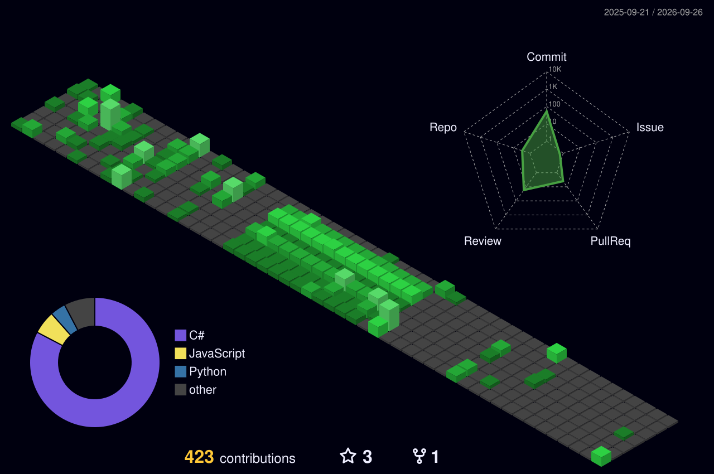

<div align="center">

# Muhammad Wali Ahmad

### Software Engineer · AI Engineer · .NET / Full-Stack · System Design

Building scalable software systems, AI-powered applications, and backend services with a focus on **clean architecture, distributed systems, and production engineering**.

[](https://muhammadwaliahmad.vercel.app/)
[](https://github.com/mwaliahmad)
[](https://linkedin.com/in/muhammadwaliahmad)
[](mailto:muhammadwaliahmad@gmail.com)

</div>

---

## About

I am a **Software Engineer with experience building backend services, full-stack applications, data-driven systems, and AI-powered products**.

My core engineering experience is centered around **C#, .NET, ASP.NET Core, SQL, APIs, and modern web applications**, with hands-on experience designing and deploying systems across Azure and Vercel.

I also work with **AI/ML and LLM-based applications**, including intelligent exam generation, automated evaluation, computer vision, plagiarism detection, and NLP systems.

Currently, I am particularly interested in:

* **System Design & Distributed Systems**
* **Backend & API Engineering**
* **AI Engineering & LLM Applications**
* **Scalable Software Architecture**
* **High-Performance & Concurrent Systems**
* **Cloud & Production Engineering**

I enjoy understanding how systems work internally and designing solutions that are **reliable, scalable, maintainable, and practical**.

---

## Engineering Focus

<table>
<tr>
<td width="50%" valign="top">

### Software Engineering

* C# / .NET / ASP.NET Core
* REST APIs & Backend Systems
* Entity Framework Core
* SQL & Database Design
* Next.js & Full-Stack Development
* Authentication & Authorization
* Clean Architecture
* API Design
* Testing & Debugging

</td>
<td width="50%" valign="top">

### AI Engineering

* LLM Applications
* AI Agents
* NLP & Transformers
* Computer Vision
* RAG & Embeddings
* Automated Evaluation
* AI-powered SaaS
* Model Integration
* ML Systems

</td>
</tr>
<tr>
<td width="50%" valign="top">

### System Design

* Distributed Systems
* High-throughput APIs
* Event-driven Architecture
* Message Queues
* Caching
* Database Scaling
* Concurrency & I/O
* Fault Tolerance
* Observability

</td>
<td width="50%" valign="top">

### Cloud & Infrastructure

* Microsoft Azure
* Docker
* Git & GitHub
* CI/CD
* Vercel
* Linux
* Postman
* Power BI
* Cloud-based Application Architecture

</td>
</tr>
</table>

---

## Tech Stack

### Languages


### Backend & Frameworks


### AI & Data


### Cloud & Tools


---

## Professional Experience

### Associate Software Engineer · Intelliwork

**Feb 2025 – Oct 2025**

Worked on enterprise software and smart-meter data systems, focusing on backend services, APIs, database integration, and device communication.

* Developed and maintained **.NET-based backend services and Windows Services**.
* Worked on a **Meter Data Collection (MDC) system** for smart-meter data synchronization.
* Integrated multi-vendor meter communication with downstream **Meter Data Management systems**.
* Implemented APIs for device operations, meter reads/writes, event history, and system monitoring.
* Worked with **C#, .NET Framework, SQL, MySQL, REST APIs, and enterprise integrations**.
* Investigated production issues across services, APIs, databases, and device communication layers.

---

## Selected Engineering Projects

### 🎓 Examifo

**Online Exam & Assessment Platform for Educators**

[](https://examifo.com)

A full-stack assessment platform for building, delivering, and evaluating exams, quizzes, and forms with automated grading and proctoring.

* Built a full assessment lifecycle: exam builder, question bank, delivery controls, live monitoring, and results/analytics.
* Implemented **six question types** — single choice, multiple select, true/false, short answer, essay, and coding — each with its own evaluation path.
* Built **automatic evaluation pipelines**: instant scoring for objective questions, test-case execution for coding questions, and AI-assisted grading for written responses.
* Developed **configurable proctoring controls** — fullscreen enforcement, tab-switch monitoring with configurable thresholds, and clipboard restriction — with flag-or-auto-submit violation handling.
* Designed a **reusable question bank** with subject/difficulty/tag categorization for reuse across assessments.
* Built a **live response dashboard** tracking participant progress and submission status in real time.
* Implemented **question-level analytics** (class averages, per-question performance) to surface which questions need revision.
* Built **access control for delivery**: participant access codes, timed windows, and attempt limits.

**Focus:** Full-Stack Engineering · Automated Assessment · AI-Assisted Grading · Exam Proctoring · EdTech


---

### 🏫 UET Admission Portal

**Production Full-Stack Admissions Platform**

[](https://apply.uet.edu.pk/)

A production admissions platform used to support large-scale university admissions workflows.

* Built backend services using **ASP.NET Web API**.
* Developed frontend workflows using **Razor Pages**.
* Implemented authentication, application processing, and admission workflows.
* Worked on automated merit-list generation and application processing.
* Designed workflows capable of supporting **20,000+ applicants/users**.

**Focus:** Backend Engineering · Database Systems · Production Applications · Scalability

---

### ✍️ AutoGrade

**AI-Powered Automated Essay Evaluation**

[](https://autograde-murex.vercel.app/)

An NLP-based assessment system for automated essay evaluation.

* Built an automated essay grading pipeline using **BERT-based models**.
* Implemented rubric-based evaluation for structured assessment.
* Developed REST APIs and a full-stack web interface.
* Combined ML models with application-level evaluation workflows.

**Focus:** NLP · Machine Learning · AI Engineering · Full-Stack Development

---

### 🧠 Neural Network From Scratch

[](https://github.com/mwaliahmad/Neural-Network-for-both-csv-and-images-data-)

Implemented a neural network from first principles without ML frameworks.

* Custom forward propagation
* Backpropagation
* Activation functions
* Loss functions
* Gradient-based optimization
* Hyperparameter tuning
* Support for tabular and image data

**Focus:** Machine Learning Fundamentals · Numerical Computing · Model Architecture

---

### 🏫 ApnaClassroom

[](https://apna-classroom-nine.vercel.app/)

A full-stack learning management platform with AI-powered academic features.

* Course and assignment management
* Attendance and grading workflows
* Authentication and authorization
* AI-based plagiarism detection
* Analytics dashboards
* REST APIs and database integration

**Focus:** Full-Stack Engineering · AI Integration · SaaS Architecture

---

## System Design & Architecture

I am actively building deeper expertise in designing **scalable and distributed software systems**.

Current areas of interest include:

```text
                    ┌─────────────────┐
                    │    Clients      │
                    └────────┬────────┘
                             │
                    ┌────────▼────────┐
                    │   API Gateway   │
                    └────────┬────────┘
                             │
              ┌──────────────┼──────────────┐
              │              │              │
       ┌──────▼─────┐ ┌──────▼─────┐ ┌──────▼─────┐
       │  Services  │ │ AI Services│ │ Background │
       │    .NET    │ │  FastAPI   │ │   Workers  │
       └──────┬─────┘ └──────┬─────┘ └──────┬─────┘
              │              │              │
              └──────────────┼──────────────┘
                             │
                   ┌─────────▼─────────┐
                   │ Event / Message   │
                   │      Layer        │
                   └─────────┬─────────┘
                             │
                ┌────────────┼────────────┐
                │            │            │
          ┌─────▼────┐ ┌─────▼────┐ ┌────▼─────┐
          │   SQL    │ │  Cache   │ │  Object  │
          │ Database │ │  Layer   │ │ Storage  │
          └──────────┘ └──────────┘ └──────────┘
```

### Topics I Explore

* API Gateway & Service Architecture
* Horizontal Scaling
* Caching Strategies
* Database Indexing & Optimization
* Message Queues & Event-Driven Systems
* Kafka & Asynchronous Processing
* Distributed Transactions
* Rate Limiting
* Load Balancing
* Fault Tolerance
* Observability
* Concurrent I/O
* `epoll` and `io_uring`
* High-throughput backend systems

---

## Engineering Interests

```text
Software Engineering
        │
        ├── Backend Engineering
        │       ├── .NET
        │       ├── APIs
        │       └── Databases
        │
        ├── System Design
        │       ├── Distributed Systems
        │       ├── Scalability
        │       └── Performance
        │
        └── AI Engineering
                ├── LLM Applications
                ├── AI Agents
                ├── NLP
                └── Computer Vision
```

My goal is to work at the intersection of **strong software engineering and practical AI**, building systems where AI capabilities are supported by reliable backend architecture.

---

## Recognition

* **Gold Microsoft Learn Student Ambassador**
* **Lead, Microsoft Learn Student Ambassadors, UET Lahore**
* **UET Merit Scholarship**, awarded across five semesters
* **98.1 percentile**, National IT Skill Competency Test 2026
* **Dean's Honour Roll**, multiple semesters
* **Microsoft technical workshops and community sessions**, 15+ sessions
* Mentored **250+ students** through technical learning and community activities

---

## GitHub Activity

<div align="center">


<br><br>


<br><br>



</div>

---

## Connect

<div align="center">

[](https://muhammadwaliahmad.vercel.app/)
[](https://linkedin.com/in/muhammadwaliahmad)
[](https://github.com/mwaliahmad)
[](mailto:muhammadwaliahmad@gmail.com)

</div>

<div align="center">

### Building software systems today. Designing scalable and intelligent systems for tomorrow.

</div>
